# Overview

Nudge (Nudging a Learner into completing a course) is a plugin that
sends timed reminders to Learners.

## Definitions
In the context of the plugin:
 - A nudge is a single "calendar event" attached to a course describing when to send a notification.
 - A nudge notification translation is a singular message sent to a user. A translation can have:
    1. A language
    1. A subject (email subject), You can use placeholders within this subject.
    1. A body (email body). You can use any email supported markup and placeholders within the translation body.
 - A nudge notification is a grouping of nudge notification translation. Eg. you might have one message "Generic Learner Reminder" which has multiple content translations
    for each language you support.

## Scope
| Nudge  | Nudge Notification | Nudge Notification Contents |
| :----- | ------------------ | --------------------------- |
| Course | Site wide          | Within a nudge notification |
## UI location
| Nudge                                                                                                          | Nudge Notification                                                        | Nudge Notification Contents                              |
| :------------------------------------------------------------------------------------------------------------- | ------------------------------------------------------------------------- | -------------------------------------------------------- |
| **From a course page** > `Sidebar administration section or cog wheel on moodle` > `Configure Nudge Reminders` | `Site Administration` >  `Courses` > `Configure Site Nudge Notifications` | **Edit a Nudge Notification** > `Add 1 more translation` |
## URL location
| Nudge                                              | Nudge Notification                      | Nudge Notification Contents                          |
| :------------------------------------------------- | --------------------------------------- | ---------------------------------------------------- |
| `/local/nudge/manage_nudges.php?courseid=COURSEID` | `/local/nudge/manage_notifications.php` | `/local/nudge/edit_notification.php?id=NOTIFICATIONID` |

## Quickstart

Let's get started with a quick example.

### Situation
We have a "Work, Health and Safety" course that **must** be completed by Learners for compliance reasons. This course is part of the "Induction set"

Learners have been reluctant to complete the course within past reporting cycles, as an L&D team you've decided that the root cause of the problem is Learner retention.
The content is not the problem here (Ideally you should review this prior to indundating Learners), the issue is just that the course is long and Learners often forget to return after making progress.

You want to use the nudge plugin to "nudge" (Literal meaning not the [L&D term](https://elearningindustry.com/nudge-learning-in-workplace)) Learners into completing the full course.
#### Solution
You've decided that the following messages are needed:
1. A welcome message to the course (Learners). This will happen one hour after the Learner is enrolled.
1. A reminder to all Learners that haven't completed the course two weeks after their enrolment.
1. This is the due date - Failing the first message encouraging the user you've decided to add some accountability by messaging both the Learner **and their Managers** after a month with no completion.
1. Finally the team has decided that course should end in 1 and a half months and that a last minute reminder should be sent out a 1 week prior.

### Planning
Before setting up the course and reminders you've sat down with the team and come up with some draft messages.


#### Template variables
Remember that you can use the following infomation about the Learners, Course and Email sender.
```
{user_firstname} -> user's firstname
{user_lastname} -> user's lastname
{course_fullname} -> course's fullname
{course_shortname} -> course's shortname
{course_link} -> course's link
{course_enddate} -> course's end date
{sender_firstname} -> sender's firstname
{sender_lastname} -> sender's lastname
{sender_email} -> sender's email
{notification_title} -> notification's title
```
This may change in the future so you can always check the updated options when editing a notification:
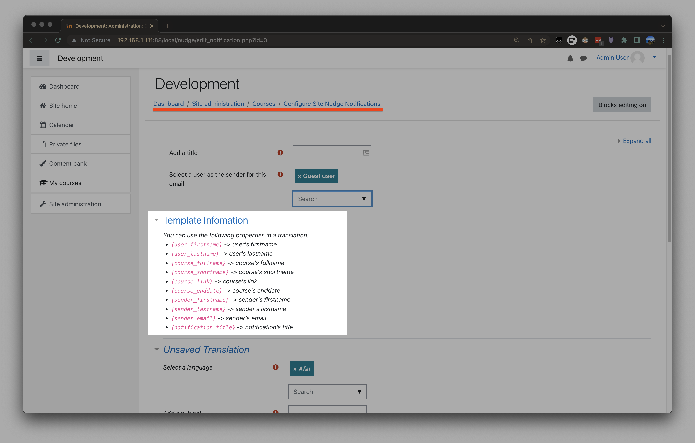

#### Message design

<details>
<summary>Welcome message</summary>
First we've decided to create a welcome message

The subject is as follows:
```
Welcome to {course_fullname}!
```

The body is as follows in both plaintext and html (If you don't know HTML don't worry you can simply use the normal MOODLE/Totara editor):
```text
Hi {user_firstname},

It's great to see you've enrolled in {course_fullname}. This course is part of the of the Induction set.

This course will end on {course_enddate}. We'll send you a reminders:
- If you haven't completed the course after two weeks.
- If you haven't completed the course after a month, In this case we'll also let your manager know.
- One week before the course ends on {course_enddate}

Thanks for enrolling,
If you have any questions feel free to reach out at: {sender_email}.

{sender_firstname} {sender_lastname}
```

```html
<p>Hi {user_firstname},</p>
<p>It's great to see you've enrolled in <strong>{course_fullname}</strong>. This course is part of the of the Induction set.</p>
<p>This course will end on {course_enddate}. We'll send you a reminders both:</p>
<ul>
    <li>if you haven't completed the course after two weeks.</li>
    <li>if you haven't completed the course after two weeks.</li>
</ul>
<p>Thanks for enrolling,</p>
<p>If you have any questions feel free to reach out at: {sender_email}.</p>
<p>{sender_firstname} {sender_lastname}</p>
```
</details>

<details>
<summary>Two week reminder</summary>
Subject:
```text
You need to complete {course_fullname} on the Example LMS
```

Body:
```text
Hi {user_firstname},

This is your two week reminder for completing the course "{course_fullname}" on the Example LMS.

You can access the course here: {course_link}.

Your next reminder will be in two weeks and will also notify your manager.

If you need assistance please contact us at: {sender_email}.
{sender_firstname} {sender_lastname}
```
```html
<p>Hi {user_firstname},</p>
<p>This is your two week reminder for completing the course <strong>{course_fullname}</strong> on the Example LMS.</p>
<p>You can access the course here: {course_link}.</p>
<p>Your next reminder will be in two weeks and will also notify your manager.</p>
<p>If you need assistance please contact us at: {sender_email}.</p>
<p>{sender_firstname} {sender_lastname}</p>
```
</details>

<details>
<summary>One month message</summary>
Next lets design a one month reminder message for **both** the Learner and their Managers.

###### First the Learner message:
Subject:
```text
Your completion is due for {course_fullname} on the Example LMS
```

Body:
```text
Hi {user_firstname},

We still have your course completion for {course_fullname} as <strong>incomplete</strong> and the course is now due.

You can access the course here: {course_link}.

Your Managers have been notified to assist you if required.

As always you can reach us at: {sender_email} if assistance is required.
{sender_firstname} {sender_lastname}
```
```html
<p>Hi {user_firstname},</p>
<p>We still have your course completion for {course_fullname} as <strong>incomplete</strong> and the course is now due.</p>
<p>You can access the course here: {course_link}.</p>
<p>Your Managers have been notified to assist you if required.</p>
<p>As always you can reach us at: {sender_email} if assistance is required.</p>
<p>{sender_firstname} {sender_lastname}</p>
```

###### Now lets let their manager know:
Subject
```text
{user_firstname} {user_lastname} is required to finish the {course_fullname} course on the Example LMS
```

```text
Hi there,

We're contacting you as {user_firstname} {user_lastname}'s manager.

{user_firstname} needs to complete the {course_fullname} course on the Example LMS.

They can access this learning at: {course_link}. Since {user_firstname} has yet to complete the course on prior notifications it might be worth reaching out to see if you can assist them.

If you have queries please direct them to {sender_email}.
{sender_firstname} {sender_lastname}
```
```html
<p>Hi there,</p>
<p>We're contacting you as <strong>{user_firstname} {user_lastname}'s manager</strong>.</p>
<p>{user_firstname} needs to complete the {course_fullname} course on the Example LMS.</p>
<p>They can access this learning at: {course_link}. Since {user_firstname} has yet to complete the course on prior notifications it might be worth reaching out to see if you can assist them.</p>
<p>If you have queries please direct them to {sender_email}.</p>
<p>{sender_firstname} {sender_lastname}</p>
```
</details>

<details>
<summary>Course conclusion message</summary>
This is to the Learner only.

Subject:
```text
LAST CHANCE - You haven't completed {course_fullname}
```

Body:
```
Hi {user_fullname},

This is your last chance to complete {course_fullname} on the Example LMS.

You may still complete {course_fullname} at: {course_link}.

Thanks {sender_firstname}.
```
```html
<p>Hi {user_fullname},</p>
<p>This is your last chance to complete {course_fullname} on the Example LMS.</p>
<p>You may still complete {course_fullname} at: {course_link}.</p>
<p>Thanks {sender_firstname}.</p>
```
</details>


#### Adding the messages to the LMS

Ok now we have:
- A use case
- A timing plan
- Message designs

Lets add these messages as Nudge Notifications so we can reuse them for more courses within the "Induction set".

First let's [navigate to the `Configure Site Nudge Notifications` area](#ui-location).
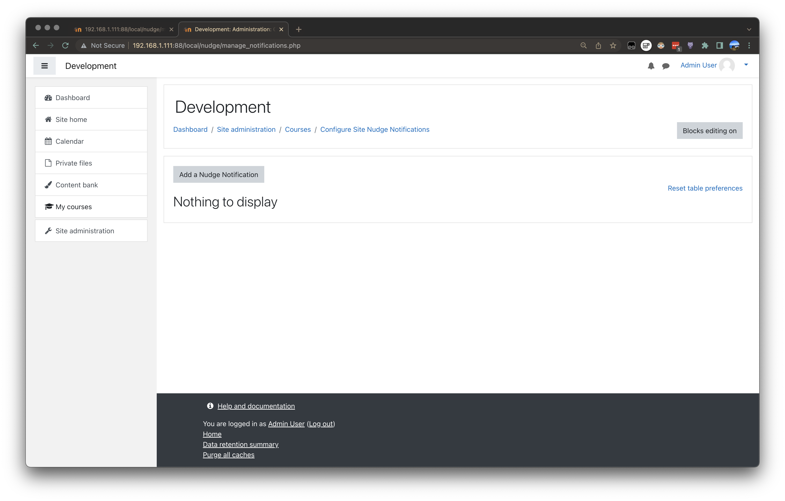

Click on `Add a Nudge Notification`.
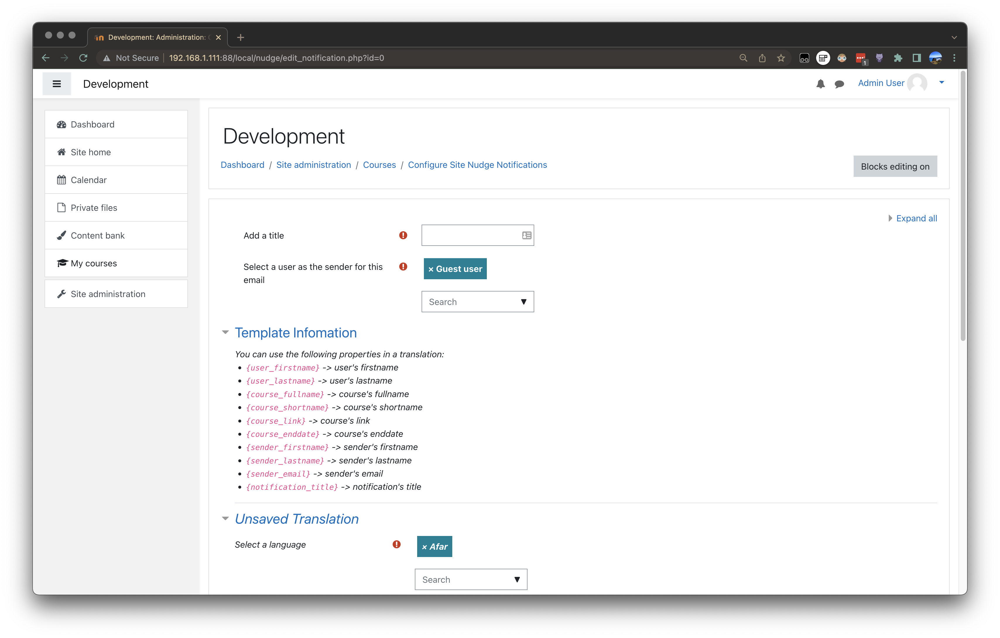

Lets start with the Welcome message, Lets add a title "Welcome Message" and a sender "The L&D Team user":
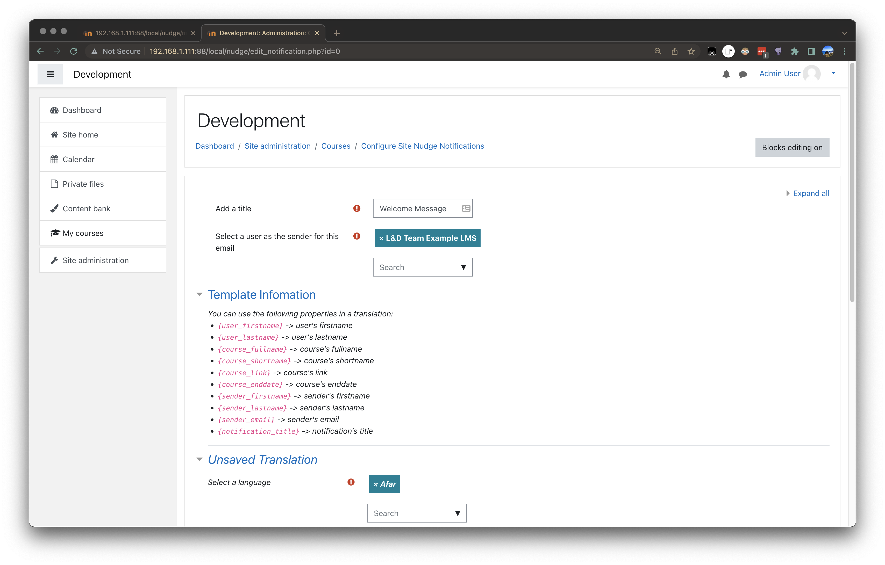

Now we can add some content:
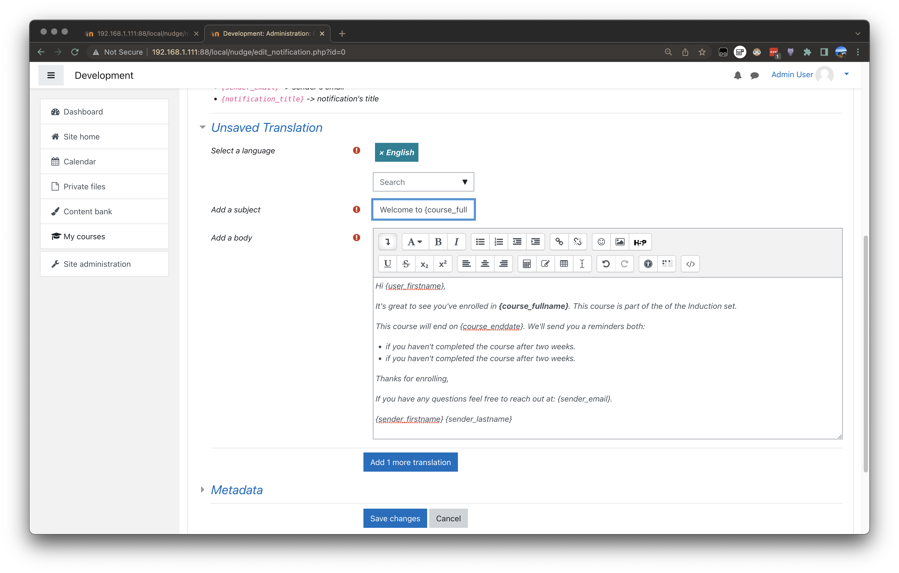

Optionally at this stage you can choose to `Add 1 more translation` which will save your progress and add another
translation or (notification content section) so that you may offer this message/notification in more than one language depending on a user's preference.

If you do not wish to add more translations you can simply `Save changes`.
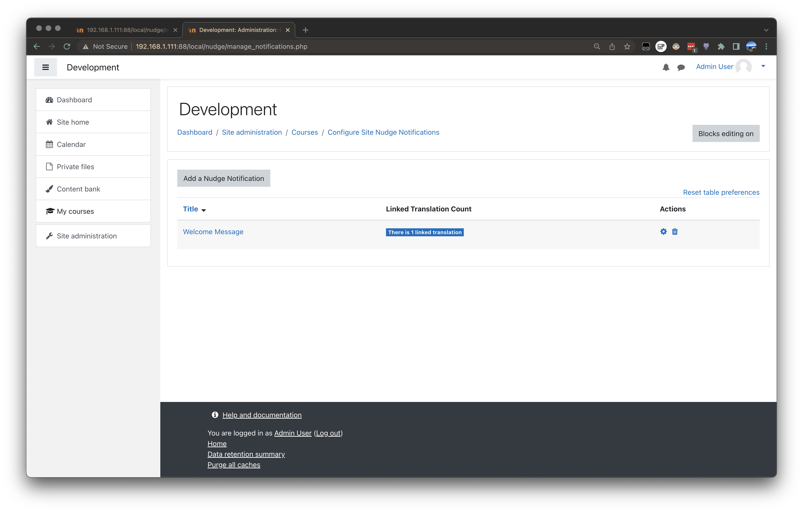

You can now see that we have a few options here:
 - We can delete the notification, this will:
    - Remove the notification
    - Deactive any nudges that make use of the notification
    - If any nudges made use of that notification it will send an email to the both the last person to edit that nudge and the creator letting them know that the nudge is broken.
    - Remove all translations linked the nudge
 - We can edit the notification again via the cog icon or by clicking on the title.
 - We can sort notifications by title.
 - As just demonstrated you can continue to edit nudges.

Lets go ahead and fill out the rest of the messages needed for "Work, Health and Safety" course as laid out [here](#message-design).

When you get to the one-month messsage you'll notice that there is no option to add seperate content for Learners and Managers within a single notifications.
This is intentional since most of the time you will have completely different content so it's better seperation of concerns to just have two notifications.
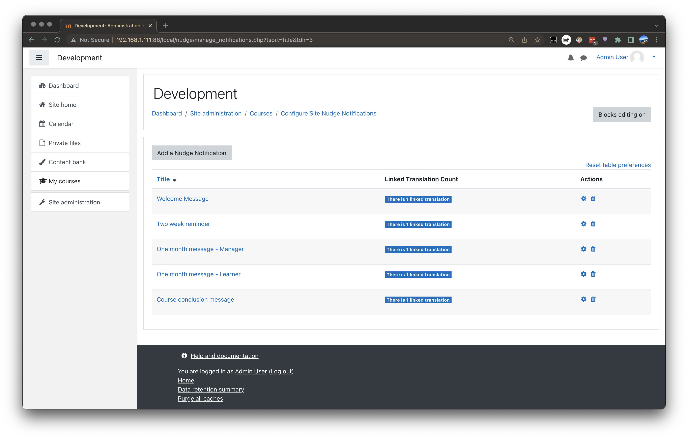

#### Scheduling these notifications for our course

Now we've added the notifications/messages to the site lets use them within our course to schedule some reminders.

Navigate to the "Work, Health and Safety" course (or in the screenshots case "Example Course") and then head into [Configure Nudge Reminders](#ui-location)


Lets add a nudge for our Welcome Message:
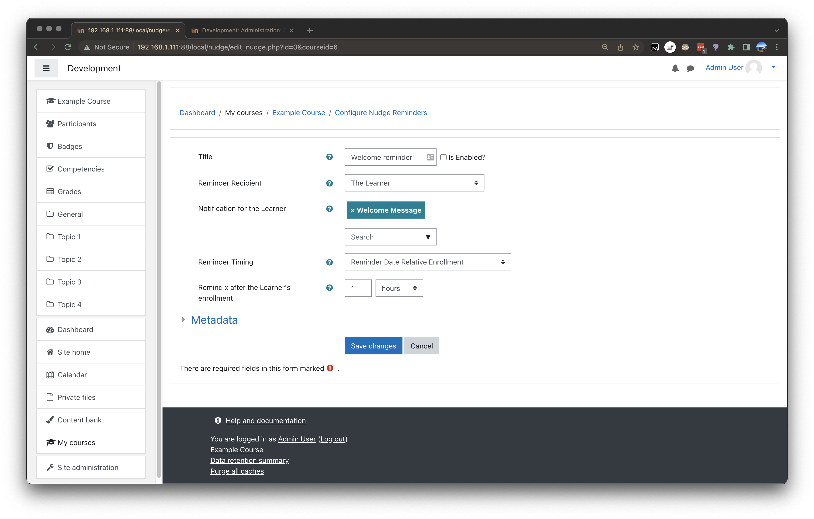

Lets walk through the setting choices:
1. We gave the Nudge a title, this is purely descriptive the same as the Nudge Notifications we've just created.
1. We choose just the learner (who hasn't completed the course) to recieve the message.
1. We chose the Nudge Notification: `Welcome Message`.
1. We chose to make the nudge send 1 hour after the learner's enrollment.
1. We left the Nudge disabled until we're ready to take the course live.

Now let's create the rest of the Nudges outlined [here](#solution).

While adding the One month Nudge you'll need to select the `Both the Learner and their Managers` option for Reminder Recipient in order to select the Manager's notification:
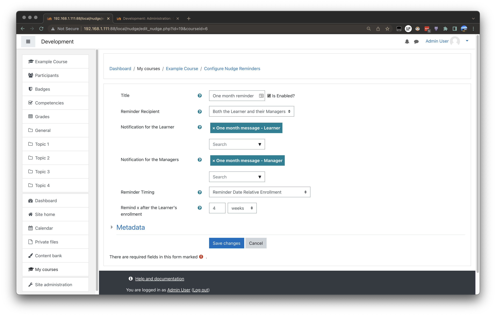

With the course conclusion Nudge you can select `Reminder Date Relative Course End` for `Reminder Timing` and input `1 Weeks` into `Reminder x before course ends`.

Once your done return to the manage screen and you should see something like the following:
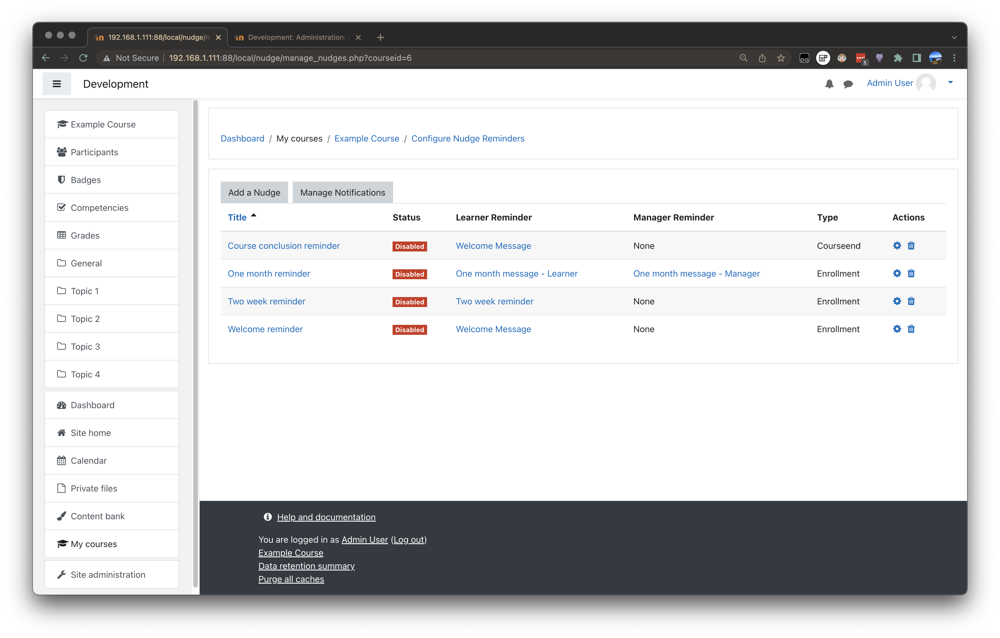

A few notes:
1. You can sort by title.
1. You can remove a nudge, this will **not** remove the linked Reminders/(Nudge Notifications).
1. You can edit a nudge via clicking either it's title or the cog.
1. You can directly edit an attached Reminder/(Nudge Notification) via clicking on its title.

#### Activation

Once your happy for messages to start going out you can simply activate all nudges and they will start working.
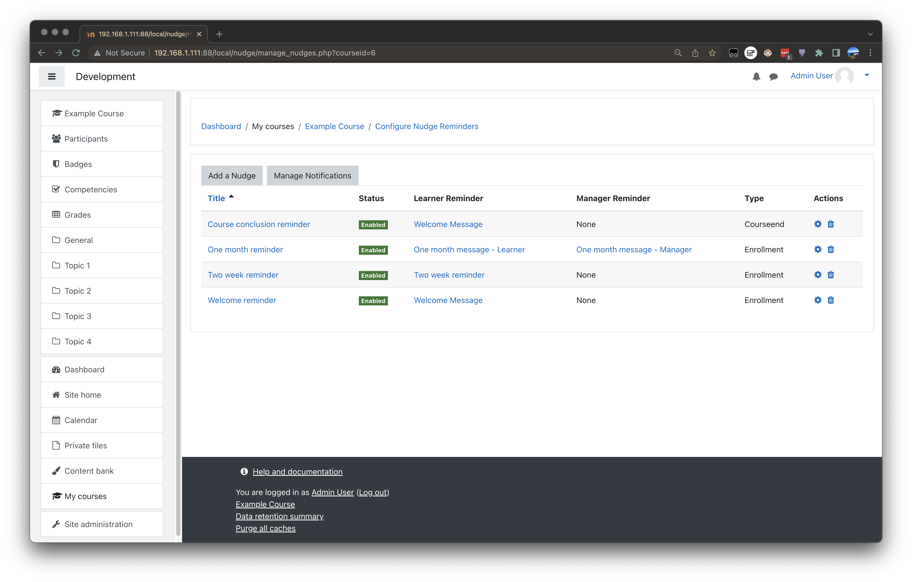

Some notes on enabled/disabled nudges:
1. A disabled nudge cannot send messages.
1. **All** nudges will disable when the course end date occurs.
1. Recurring nudges (experimental) and nudges relative to enrollment will disable only when the course ends.
1. Nudges prior to course end will disable once they've fired once.
1. Fixed date nudges will disable upon their set date.
